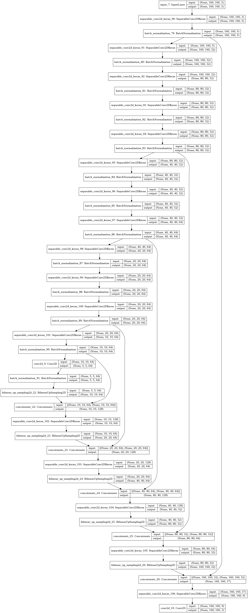

# Follow Me Write-up

## Rubics
#### 1. Provide a write-up / README document
You are reading it!

#### 2. The write-up conveys the an understanding of the network architecture.
In this project, I implemented SegNet. The goal is to identify target, pedestrians and others in pixelwise manner. This is achieved by building an series of encoder blocks. An encoder block is composed separable convolution layer. The advantage of separable convolution layers is less parameters to train. The final layer of encoder is a fully-convolution layer. As for decoder block, each decoder will first upsample the input image and concatenate with a previous encoder block. Concatenation with encoder blocks help preserve spatial information.

#### 3. The write-up conveys the student's understanding of the parameters chosen for the the neural network.

- Batch size: the given training dataset has 4,132 instances. Hence I pick batch size of 20 so that each batch can be trained with 20 images.
- Number of batches per epoch: I chose this parameter to be 200 so that each epoch trains 20 x 200 = 4,000 images (*batch size x batches per epoch*). So each epoch roughly walk through the whole training dataset.
- Epochs and learning rate: as the model is closer to local minima, the slope is smaller and probably needs smaller learning rate. In first 40 epochs I used learning rate of 0.001; and in the last 25 I used learning rate of 0.0005. The last 5 epochs are executed one by one to get the best performance.

The model takes several epoches to converge. If I reduce number of epochs, the tarining and validation loss can be high, since the model is undertrained. 

Picking too large learning rate might engender overshooting. The gradient near local minima tend to be smaller. Therefore, if the step is too large, it will bypass the minimum point and the model will fail to converge.

#### 4. The student has a clear understanding and is able to identify the use of various techniques and concepts in network layers indicated by the write-up.

- 1 by 1 convolution: this layer is using kernel shape (1x1xNk), where Nk is the number of kernels. It can be viewed as a mini neural network running over the patch. It is an cheap and efficient way to adjust the depth of layers. A common use of 1x1 convs is the reduce the number of filters.

- Fully connected layer: this layer connects every node in one layer to every node in the other layer. Fully connected layer is useful for mapping from learned features (output of CNN) to output value. Since it is an expensive operation, we usually use that at the very end of neural network.

#### 5. The student has a clear understanding of image manipulation in the context of the project indicated by the write-up.
The encoder blocks transform the original images into featrue maps. For example, in human face recognition, a feature map can be a mask of eyes or a mask of noses. Deep learning exploits modern computational power to explore nonintuitive features as opposed to man-crafted image filters.

The decoder block first upsample the input layer, and concatenate the upsampled layer with a passthorgh layer. This helps preserve spatial information. Since I have 5 layers with stride 2, I can only upsample by 5 times too. The decoders perfrom transposed convolution to relate the learned features to each patch of the output layer. Finally when the decoder is as large as the original image, the softmax activation maps the output of the decoder to class number. So the loss function can be computed and backprop can be done.

One should not use too many skip connections, because it can lead to explosion of the size of the model.

#### 6. The student displays a solid understanding of the limitations to the neural network with the given data chosen for various follow-me scenarios which are conveyed in the write-up.
If we were to follow another object instead of a human, we need to replace the trainig mask images. So the interested object can be encoded in the blue channel, while the original human pixels are moved to the green channel.

If we want to classify more than three classes, RGB is not enough anymore. We may need **N** colors that is correspondent to **N** classes. And the mask images should be hot coded with **N** channels.

This model may not be able to detect other classes, because it was only trained by three classes (road, pedestrians and target).

#### 7. The model is submitted in the correct format.
My model is stored in `data/weights`.

#### 8. The neural network must achieve a minimum level of accuracy for the network implemented.
My model achieves accuracy of 42.87%.

## Future Enhancements
1. Use transposed convolutional layer instead of bilinear upsampling.
2. Add pooling layers.
3. Try differnet activation functions.

## References
|Ref. No.|Purpose|URL|
|--|--|--|
|[1]|SegNet|http://mi.eng.cam.ac.uk/projects/segnet/
|[2]|Separable Convolution Layer| https://medium.com/towards-data-science/types-of-convolutions-in-deep-learning-717013397f4d|
|[3]|Understanding Fully Connected Layer|https://stats.stackexchange.com/questions/194142/what-does-1x1-convolution-mean-in-a-neural-network|
